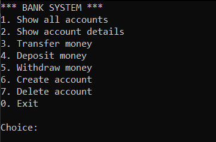
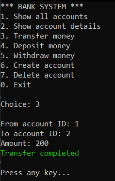
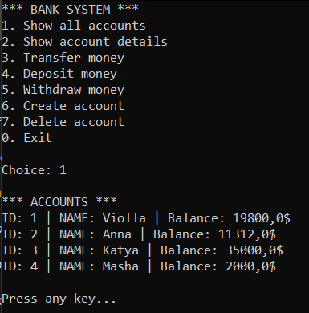

# BankAccountSystem

Учебный консольный проект на C#/.NET, реализующий простую банковскую систему  
с чистой архитектурой, доменной логикой и хранением данных в SQLite.

## Реализовано

- Доменная модель банковских аккаунтов
- Переводы, депозит и снятие средств
- Хранение данных в SQLite
- Консольный интерфейс

## Интерфейс 

_Главное меню приложения_

_Перевод средств_

_Список аккаунтов_

 